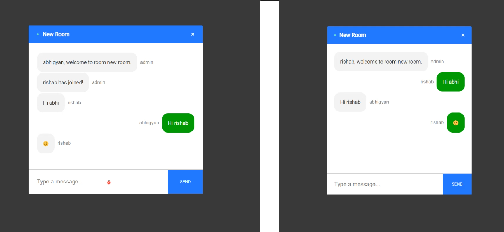

# Cartloop Chat App 

This is a chat application, developed using React, Node, and Sockets.io. Users can chat with each other in real time by joining the same chat room. Users can also send text as well as emojis. 

Multiple users can join the same chat room. Users in the same chat room are notified when new person joins the chat and can see the current online users. When someone leaves the chat, other members in the chat room are notified.

## Screenshot



## How To Use On a Single Machine:


## Getting Started

To get a local copy up and running follow these simple example steps.

### Prerequisites

Make sure Node.js is running on your local machine

# Setup Procedure:

## Step 1:
~~~bash
$ git clone https://github.com/Abhigyan001/chatbot_cartloop
$ cd chatbot_cartloop
~~~

## Step 2:
Install modules in server:

```
cd server
```
```
npm install
```
## Step 3:
Start the backend server:

```
npm start
```
## Step 4:
Install modules in client:

```
cd..
```
```
cd client
```
```
npm install
```
## Step 5:
Start the frontend server:

```
npm start
```

## Start Chatting!!!!

* Open a new terminal and start another instance of the client at a different port (Eg: port 3001). Login with a separate name and join the existing room to chat in real time *


## How To Use Chat App using Live Link:

### Step 1
Start the backend server using above instructions.

### Step 2
Open this live link: [Live Demo](https://cartloop-chatapp.netlify.app/)

Open the Live Demo in separate tabs and login with a new name and join the existing room to start chatting.

# Author

👤 **Abhigyan Mahanta**​

- Github: [@githubhandle](https://github.com/Abhigyan001)   
- Linkedin: [Linkedin Profile](https://www.linkedin.com/in/abhigyanmahanta/)
- Twitter: [@Twitter](https://twitter.com/abhigyan_001)

## 🤝 Contributing

Contributions, issues and feature requests are welcome!

Feel free to check the [issues page](issues/).

## Show your support

Give a ⭐️ if you like this project!

